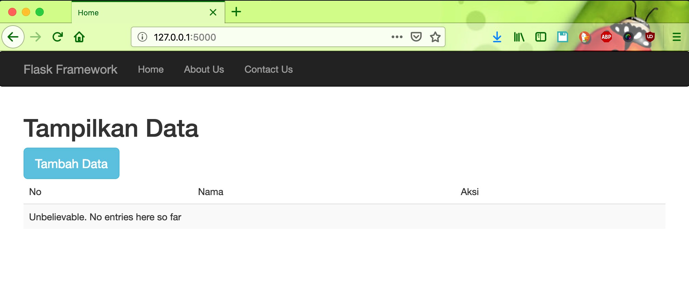
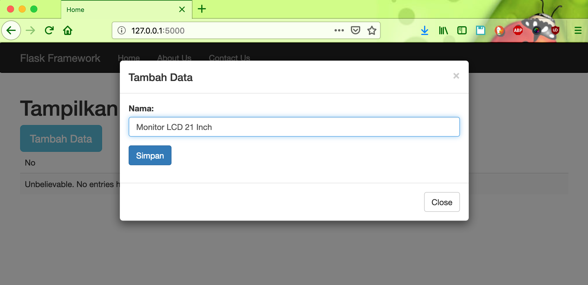
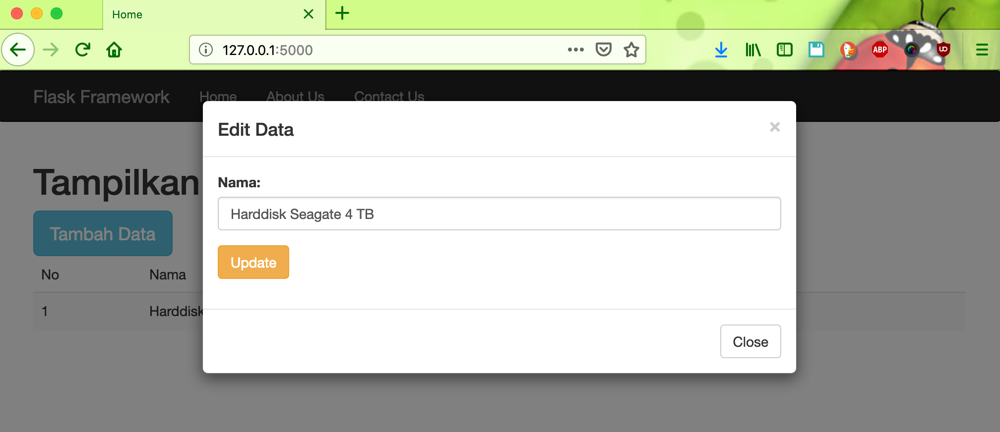
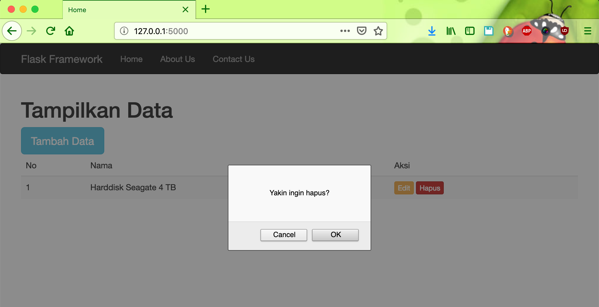

# flask-mysqldb

#### Thing to do :
1. `git clone https://github.com/hendisantika/flask-mysqldb.git`
2. `cd flask-mysqldb`
3. `pip install -r requirements.txt`
4. `python app.py`

#### Screen shot

Home Page

Add New Data

Edit Data

Hapus Data

